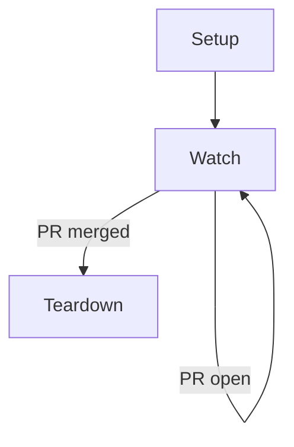

# AGENTS.md

Guidance for agents working in `workon-skill`.

## Scope

This repository contains a single portable skill spec for `/workon`.
Keep changes focused on:

- `SKILL.md` behavior and wording
- documentation clarity in `README.md`
- portability across environments (no company-internal assumptions)

## Rules

- Keep branding generic and open-source friendly.
- Prefer explicit idempotency and recovery behavior.
- Do not hardcode environment-specific defaults when they can be discovered.
- Keep human-facing updates concise and free of internal jargon.

## Validation

Before finishing, verify:

1. `SKILL.md` frontmatter is valid and complete.
2. All references are generic (no company-internal feedback doc references).
3. The setup/watch/teardown flow remains consistent and re-entrant.
