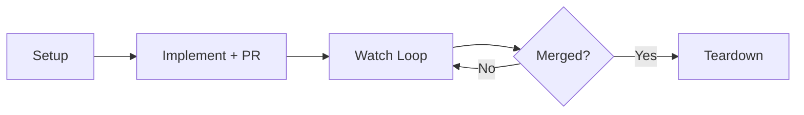

# workon-skill

[](https://github.com/dotbrains/workon-skill/actions/workflows/ci.yml)
[](https://polyformproject.org/licenses/shield/1.0.0)

Portable `/workon` skill for Linear-driven ticket execution:

1. Create an isolated worktree.
2. Implement and open a PR.
3. Watch PR health in a loop (AI review comments, CI, merge conflicts).
4. Tear down the worktree after merge.



## Repository layout

- `SKILL.md` — canonical skill definition
- `AGENTS.md` — contributor guidance for AI and human maintainers

## Usage

One-line install:

```bash
mkdir -p ~/.claude/skills/workon && curl -fsSL https://raw.githubusercontent.com/dotbrains/workon-skill/main/SKILL.md -o ~/.claude/skills/workon/SKILL.md
```

Install `SKILL.md` in your skills path, then invoke:

```text
/workon ENG-66
```

The skill is idempotent and stateful, so repeated invocations resume from the current phase.

## Requirements

- `git`
- `gh` CLI authenticated against your GitHub host
- Linear access (MCP integration or equivalent API tooling)
- Loop scheduler support (for 5-minute watch ticks)
